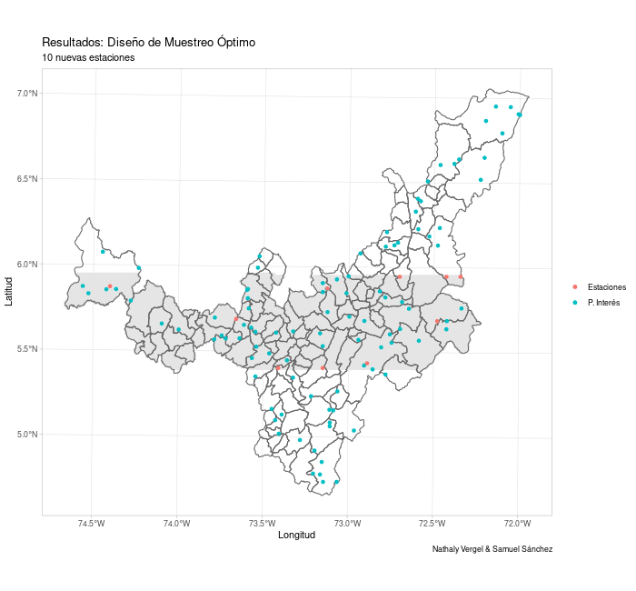
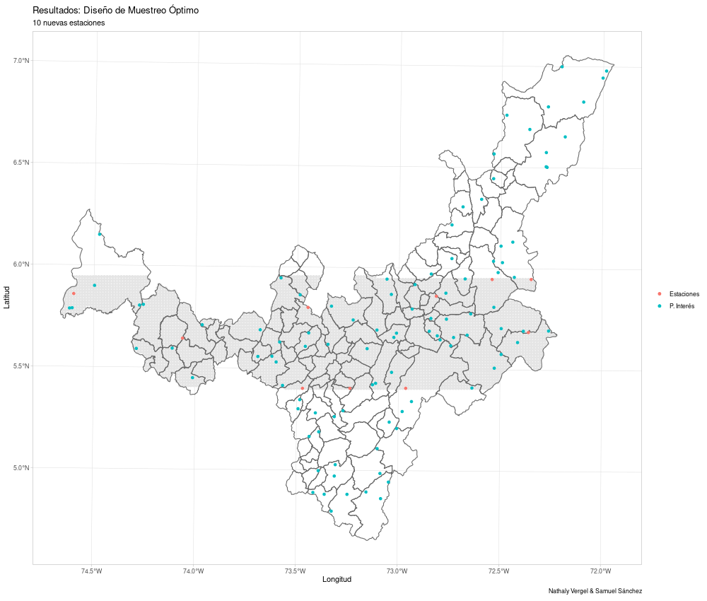
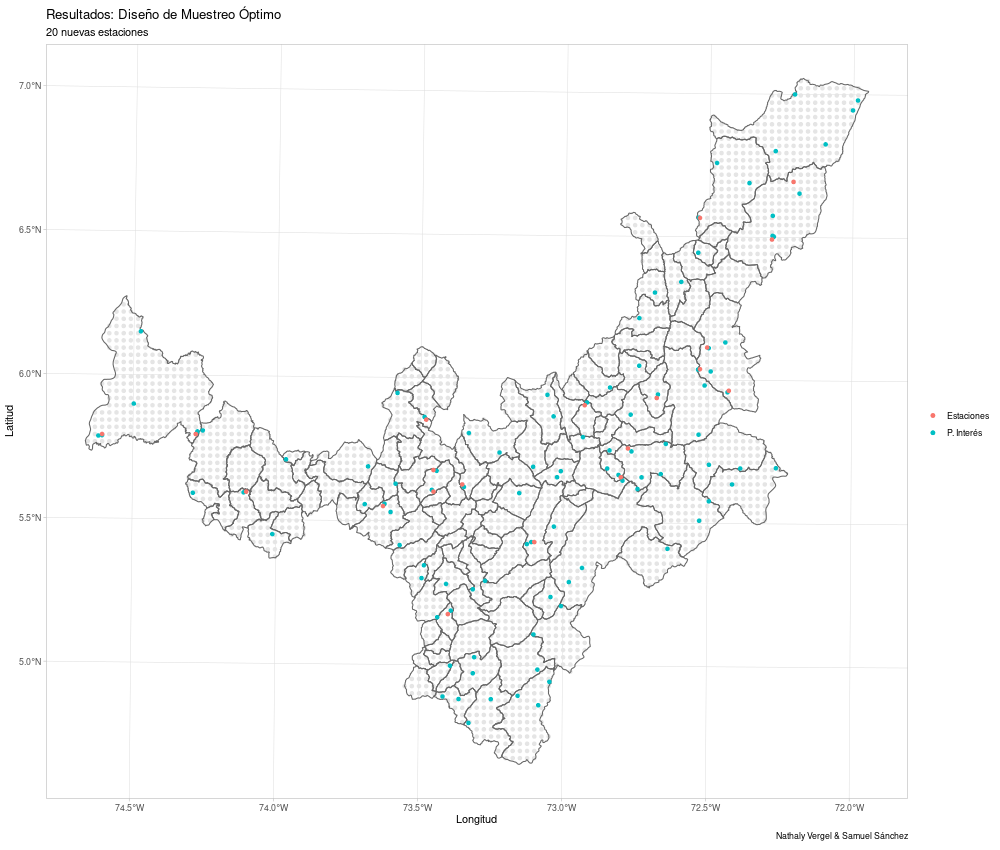
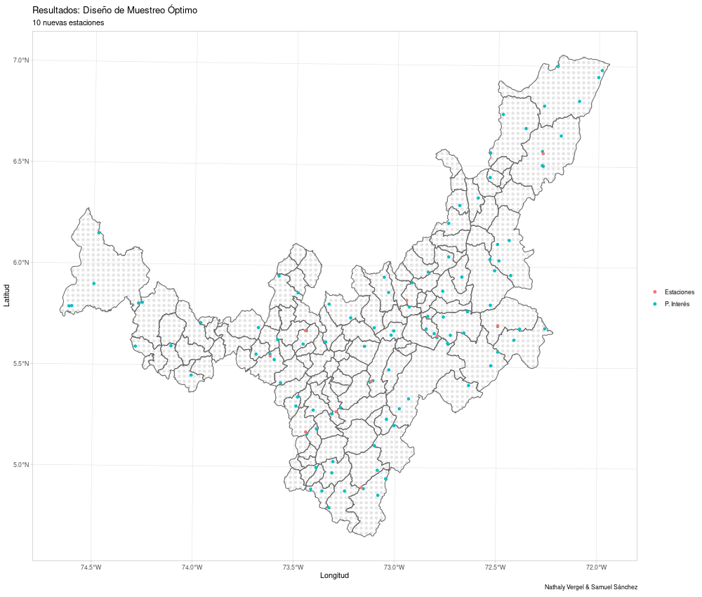
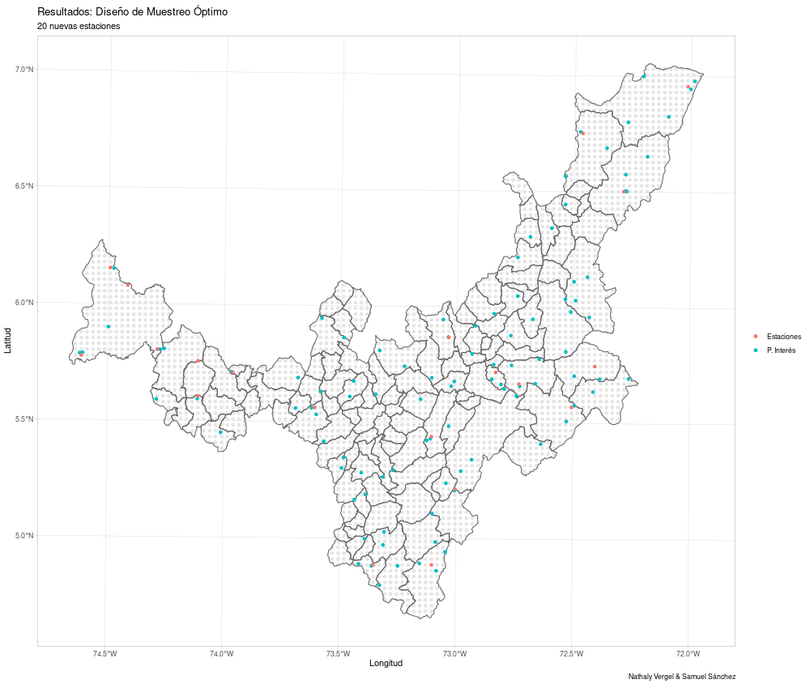

# Diseño de Muestreo Óptimo

Esta función recibe un modelo de varigrama, un mapa (archivo `.shp`) y un conjunto de puntos en los que se quieren hacer predicciones y retorna los lugares en los que se deben tomar los registros para minimizar la varianza del error de predicción a través de kriging simple, ordinario o universal.

De acuerdo con Bohórquez (2022), un diseño óptimo $S_{n}^{*}$ se define como

$$S_{n}^{*}=\arg \max_{S_{n} \in \Xi_{n}} \Phi\left(\boldsymbol{\Theta}, S_{n}\right)$$

donde $\Phi\left(\boldsymbol{\Theta}, S_{n}\right)$ es el criterio de diseño y constituye cualquier medida escalar de información obtenida a partir de la configuración $S_{n}$ y que depende del vector de parámetros. Así, si se conoce el variograma de la variable de interés, entonces es posible optimizar el esquema de muestreo de modo que se minimice una función objetivo relacionada con el error de la predicción. En particular, la varianza del error de las predicciones en $m$ lugares no observados $S_{0}=\{s_{0}^{1}, ..., s_{0}^{m}\}$ puede ser minimizada. 

*aquí mencionamos la varianza de la predicción según el tipo de kriging 
*también hablamos del método de optimización
---

```r

optimal_design <- function(k, s0, vgm_model = NULL,cov_model = NULL, 
                           krigingType = "simple",range = NULL,
                           psill = NULL, nugget = 0,
                           krig_formula = NULL,grid = NULL,map = NULL,
                           plt = T,...){

```
---

## Dependencias

* [`gstat`](https://github.com/r-spatial/gstat) (Sólo si se van a usar sus modelos de semivariograma).
* [`ggplot2`](https://github.com/tidyverse/ggplot2)
* [`sf`](https://github.com/r-spatial/sf)
* [`sp`](https://github.com/edzer/sp)

Todos estos paquetes están disponibles en [CRAN](https://cran.r-project.org/web/packages/available_packages_by_name.html#available-packages-D).

---

## Argumentos

| Argumento | Descripción |
| ------ | ------ |
|   `k`     |   Número de estaciones a ubicar   |
| `S0` | Objeto de tipo `matrix` o `data.frame` que contenga las coordenadas de las ubicaciones de interés (donde se desean hacer predicciones) |
| `vgm_model` | Objetode tipo `variogramModel` del paquete gstat que representa el modelo de semivarianza. |
| `cov_model` | Función que define un modelo de covarianza especificado por el usuario. Esta será utilizada si no se suministra el argumento `vgm_model`. Si se pasa este argumento, también se deben pasar los argumentos `range` y `psill`. Además, todos los argumentos adicionales que se pasen a la función `optimal_design` serán pasados a la función `cov_model`. Esto es útil cuando se tienen parámetros adicionales como `kappa` en el modelo Matern. |
| `krigingType`  | Tipo de kriging a utilizar, e.g. "simple", "ordinary" o "universal".  |
| `range` | Rango del modelo `cov_model`. |
| `psill` | Silla del modelo `cov_model`. |
| `nugget` | Pepita del modelo `cov_model`. Por defecto es cero. |
| `krig_formula` | Fórmula que define la variable dependiente como un modelo lineal de variables independientes, e.g. "x+y". Sólo se utiliza en el kriging universal. Es un objeto de tipo string que sólo contiene la parte independiente de la fórmula, es decir, en vez de "z ~ x + y" se debe suministrar "x + y". |
| `grid` | Objeto de tipo matrix o data.frame. Grilla de puntos en los cuales se pueden ubicar estaciones. |
| `map` | Objeto de tipo SpatialPolygonsDataFrame que limita el área geográfica donde las estaciones quieren ser ubicadas si no se pasa ningún objeto en el argumento `grid`. |
| `plt` | Booleano que determina se se debe generar un gráfico con el resultado obtenido o no. |
| `...` | Argumentos adicionales que se pasarán a la función `cov_model`. |

---

## Valor

Una lista con los siguientes objetos

| Objeto | Descripción |
| ------ | ------ |
| `coords` | Objeto de tipo `matrix` y `array` que contiene las coordenadas óptimas para las estaciones. |
| `plot` | Gráfico del paquete `ggplot2` que presenta el resultado. En él, los puntos grises representan la grilla de puntos en la que se podían situar las estaciones. |


## Detalles


---

## Ejemplo

Cargamos la librerías y scripts necesarios.

```r

library(gstat)
library(rgdal)
library(ggplot2)
library(sf)
library(sp)

source("../src/optimal_design.r")
source("../src/gstat_model.r")
source("../src/own_model.r")

```

Ahora, cargamos el mapa y creamos el modelo de semivariograma con los cuales trabajaremos.

```r

mapa <- rgdal::readOGR(dsn = "../data/Boyacá.shp")

modelo_svg <- vgm(psill = 5.665312,
                  model = "Exc",
                  range = 88033.33,
                  kappa = 1.62,
                  add.to = vgm(psill = 0.893,
                               model = "Nug",
                               range = 0,
                               kappa = 0))

my.CRS <- sp::CRS("+init=epsg:21899") # https://epsg.io/21899


mapa <- spTransform(mapa,my.CRS)

```

Ya podemos crear un conjunto de puntos en el mapa en los cuales queremos predecir de manera óptima y llamar a la función `optimal_design`.

```r

target <- sp::spsample(mapa,n = 100, type = "random") # Puntos sobre los que queremos realizar una predicción de varianza mínima.

optimal_design(k = 10, s0 = target,vgm_model = modelo_svg,
               krigingType = "simple",map = mapa) -> res1

res1

```

Las coordenadas óptimas son

```r

##      x1       x2
## [1,] 516425.7 1121174
## [2,] 455101.3 1082149
## [3,] 404926.9 1132324
## [4,] 502488.3 1188073
## [5,] 544300.3 1246610
## [6,] 466251.2 1135111
## [7,] 424439.2 1034762
## [8,] 285065.7 1146261
## [9,] 338027.7 1115599
## [10,] 402139.4 1082149

```

El gráfico se muestra a continuación. Los puntos grises representan la grilla de puntos en los que se podían ubicar las estaciones.


A continuación se muestran otros ejemplos para kriging ordinario y kriging universal suministrando una grilla específica de puntos en los que se pueden ubicar las estaciones y un modelo de semivarianza del paquete `gstat`.

```r

mi.grilla <- sp::spsample(mapa,n=1e4,type = "regular")
mi.grilla <- mi.grilla[2e3:7e3]                          


optimal_design(k=10,s0 = target,model = modelo_svg,
               krigingType = "ordinary",
               grid = as.data.frame(mi.grilla)) -> res2

res2


optimal_design(k = 10, s0 = target, model = modelo_svg,
               krigingType = "universal", form = "x + I(x^2) + y",
               grid = as.data.frame(mi.grilla)) -> res3

res3


```





Ahora presentaremos cuatro ejemplos suministrando un modelo de covarianza definido manualmentes y los distintos tipos de kriging.

```r

my_cov_model <- function(h, range, psill, nugget = 0){
  ifelse(h == 0,
         nugget + psill,
         ifelse(h > 0,
                psill*(exp((-1)*h/range)),
                "Las distancias deben ser positivas"
         )
  )
}

# Parámetros
my_range = 20000
my_psill = 5
my_nugget = 1


```

Se llama  a la función  `optimal_design` cuatro veces

```r
optimal_design(k = 20, s0 = as.data.frame(target), cov_model = my_cov_model,
               krigingType = "simple",map = mapa,
               range = my_range, psill = my_psill,
               nugget = my_nugget) -> res4

res4


optimal_design(k = 10, s0 = as.data.frame(target), cov_model = my_cov_model,
               krigingType = "ordinary",map = mapa,
               range = my_range, psill = my_psill,
               nugget = my_nugget) -> res5

res5


optimal_design(k = 20, s0 = as.data.frame(target), cov_model = my_cov_model,
               krigingType = "universal",map = mapa,
               range = my_range, psill = my_psill,
               nugget = my_nugget,krig_formula = "x + y") -> res6

res6


optimal_design(k = 10, s0 = as.data.frame(target), cov_model = my_cov_model,
               krigingType = "universal",map = mapa,
               range = my_range, psill = my_psill,
               nugget = my_nugget,krig_formula = "x + sqrt(y)") -> res7

res7


```

Y se obtienen los respectivos resultados:








---
## Referencias

* Bohorquez, M. (2022). *Estadística Espacial Espacio-Temporal para Campos Aleatorios Escalares y Funcionales*. [Notas de Clase].
* Cressie, N. (1993). *Statistics for Spatial Data*. John Wiley & Sons. Inc.

---

Creado por: 
* Nathaly Vergel  (nvergel@unal.edu.co)
* Samuel Sánchez (ssanchezgu@unal.edu.co)
